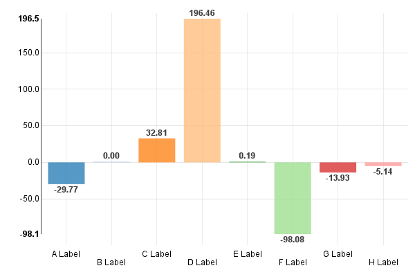

==================
Discrete Bar Chart
==================

See the original `discrete bar chart example`_.

.. _discrete bar chart example: http://nvd3.org/examples/discreteBar.html

.. code-block:: python

   import nvd3

   def example_data():
       return [
           {
               "key": "Cumulative Return",
               "values": [
                   {
                       "label" : "A Label" ,
                       "value" : -29.765957771107
                   },
                   {
                       "label" : "B Label" ,
                       "value" : 0
                   },
                   {
                       "label" : "C Label" ,
                       "value" : 32.807804682612
                   },
                   {
                       "label" : "D Label" ,
                       "value" : 196.45946739256
                   },
                   {
                       "label" : "E Label" ,
                       "value" : 0.19434030906893
                   },
                   {
                       "label" : "F Label" ,
                       "value" : -98.079782601442
                   },
                   {
                       "label" : "G Label" ,
                       "value" : -13.925743130903
                   },
                   {
                       "label" : "H Label" ,
                       "value" : -5.1387322875705
                   }
               ]
           }
       ]

   chart = nvd3.DiscreteBarChart()
   chart.x("function(d) { return d.label }")  # Specify the data
                                              # accessors.
   chart.y("function(d) { return d.value }")
   chart.staggerLabels(True)  # Too many bars and not enough room? Try
                              # staggering labels.
   chart.tooltip.enabled(False)  # Don't show tooltips
   chart.discretebar.showValues(True)  # ...instead, show the bar value
                                       # right on top of each bar.
   chart.duration(350)

   data_supplier = nvd3.StaticDataSupplier(example_data())
   nvd3.Container(chart, data_supplier, width=600, height=400)

