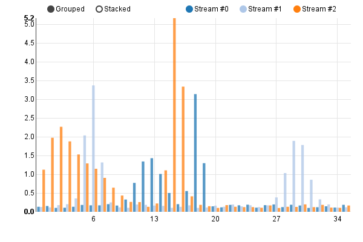

===============================
Stacked/Grouped multi-bar chart
===============================

See the original `multi-bar chart example`_.

.. _multi-bar chart example: http://nvd3.org/examples/multiBar.html

.. code-block:: python

   import math
   import random
   import nvd3

   def bump(a, m):
       x = 1 / (.1 + random.random())
       y = 2 * random.random() - .5
       z = 10 / (.1 + random.random())
       for i in range(m):
           w = (i / float(m) - y) * z
           a[i] += x * math.exp(-w * w)

   # Inspired by Lee Byron's test data generator.
   def stream_layers(n, m, o=0):

       def function(_):
           a = [o + o * random.random() for i in xrange(m)]
           for _ in range(5):
               bump(a, m)
           return map(lambda (i, d): {"x": i, "y": max(0, d)}, enumerate(a))

       return map(function, xrange(n))

   # Generate some nice data.
   def example_data():

       def entry((i, data)):
           return {"key": "Stream #" + str(i), "values": data}

       a = stream_layers(3, int(round(10 + random.random() * 100)), 0.1)
       return map(entry, enumerate(a))

   chart = nvd3.MultiBarChart()
   chart.duration(350)
   chart.reduceXTicks(True)  # If 'false', every single x-axis tick label
                             # will be rendered.
   chart.rotateLabels(0)  # Angle to rotate x-axis labels.
   chart.showControls(True)  # Allow user to switch between 'Grouped' and
                             # 'Stacked' mode.
   chart.multibar.groupSpacing(0.1)  # Distance between each group of
                                     # bars.
   chart.xaxis.tickFormat("d3.format(',f')")
   chart.yaxis.tickFormat("d3.format(',.1f')")

   data_supplier = nvd3.StaticDataSupplier(example_data())
   nvd3.Container(chart, data_supplier, width=600, height=400)

