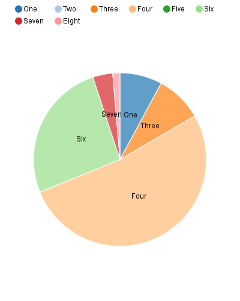
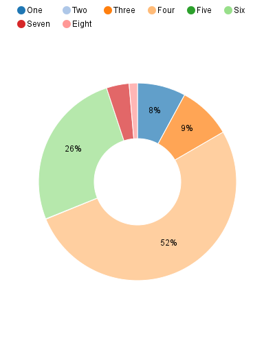

=========
Pie chart
=========

Regular pie chart
=================

.. code-block:: python

   import nvd3

   # prepare the data
   x = ["One", "Two", "Three", "Four", "Five", "Six", "Seven","Eight"]
   y = [29.76, 0, 32.80, 196.45, 0.19, 98.07, 13.92, 5.138]
   data = [{"label": l, "value": v} for l, v in zip(x, y)]
   # build the chart
   pie_chart = nvd3.PieChart()
   pie_chart.x("function(d) { return d.label; }")
   pie_chart.y("function(d) { return d.value; }")
   pie_chart.showLabels(True)
   # show the HTML
   data_supplier = nvd3.StaticDataSupplier(data)
   nvd3.Container(pie_chart, data_supplier)

Donut chart
===========

.. code-block:: python

   import nvd3

   x = ["One", "Two", "Three", "Four", "Five", "Six", "Seven","Eight"]
   y = [29.76, 0, 32.80, 196.45, 0.19, 98.07, 13.92, 5.138]
   data = [{"label": l, "value": v} for l, v in zip(x, y)]

   chart = nvd3.PieChart()
   chart.x("function(d) { return d.label; }")
   chart.y("function(d) { return d.value; }")
   chart.showLabels(True)  # Display pie labels
   chart.labelThreshold(.05)  # Configure the minimum slice size for
                              # labels to show up
   chart.labelType("percent")  # Configure what type of data to show in
                               # the label. Can be "key", "value" or
                               # "percent"
   chart.donut(True)  # Turn on Donut mode. Makes pie chart look tasty!
   chart.donutRatio(.35)  # Configure how big you want the donut hole
                          # size to be.

   data_supplier = nvd3.StaticDataSupplier(data)
   nvd3.Container(chart, data_supplier)

