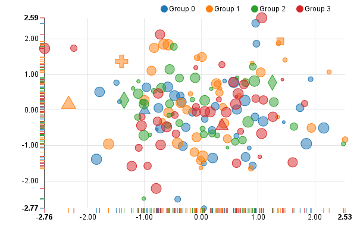

======================
Scatter / Bubble Chart
======================

See the original `scatter chart example`_.

.. _scatter chart example: http://nvd3.org/examples/scatter.html

.. code-block:: python

   import random
   import nvd3

   SHAPES = ['circle', 'cross', 'triangle-up', 'triangle-down',
             'diamond', 'square']

   def normal(mu=0, sigma=1):
       return random.gauss(mu, sigma)

   def _get_point(j):
       l = len(SHAPES)
       shape = SHAPES[j % l] if random.random() > 0.95 else "circle"
       point = {
           "x": normal(),
           "y": normal(),
           "size": random.random(),
           "shape": shape
       }
       return point

   def _get_points(points):
       return [_get_point(j) for j in xrange(points)]

   def random_data(groups, points):  # groups, # points per group
       data = [{"key": "Group %d" % i, "values": _get_points(points)}
               for i in xrange(groups)]
       return data

   chart = nvd3.ScatterChart()
   chart.showDistX(True)  # showDist, when true, will display those little
                          # distribution lines on the axis.
   chart.showDistY(True)
   chart.duration(350)
   chart.color("d3.scale.category10().range()")
   # Configure how the tooltip looks.
   # chart.tooltipContent("""function(key) {
   #     return '<h3>' + key + '</h3>';
   # }""")

   # Axis settings
   chart.xaxis.tickFormat("d3.format('.02f')")
   chart.yaxis.tickFormat("d3.format('.02f')")

   data_supplier = nvd3.StaticDataSupplier(random_data(4, 40))
   nvd3.Container(chart, data_supplier, width=600, height=400)

