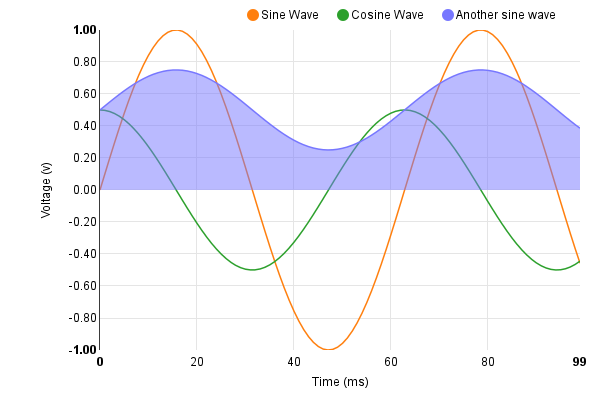

=================
Simple line chart
=================

See the original `line chart example`_. The line chart has the following
features:

   * ability to combine as many line series’ as you want;
   * tooltip which shows all visible series data;
   * line transitions that happen when turning on/off series, and when
     resizing chart;
   * can specify whether a series should be an area chart.

.. _line chart example: http://nvd3.org/examples/line.html

.. code-block:: python

   import math
   import nvd3

   # Simple test data generator
   def sin_and_cos():
       sin = []
       sin2 = []
       cos = []

       # Data is represented as an array of {x,y} pairs.
       for i in range(100):
           sin.append({"x": i, "y": math.sin(i / 10.0)})
           sin2.append({"x": i, "y": math.sin(i / 10.0) * 0.25 + 0.5})
           cos.append({"x": i, "y": 0.5 * math.cos(i / 10.0)})

       # Line chart data should be sent as an array of series objects.
       return [
           {
               "values": sin,  # values - represents the array of {x,y}
                               # data points
               "key": "Sine Wave",  # key  - the name of the series.
               "color": "#ff7f0e"  # color - optional: choose your own
                                   # line color.
           },
           {
               "values": cos,
               "key": "Cosine Wave",
               "color": "#2ca02c"
           },
           {
               "values": sin2,
               "key": "Another sine wave",
               "color": "#7777ff",
               "area": True  # area - set to True if you want this line
                             # to turn into a filled area chart.
           }
       ]

   chart = nvd3.LineChart()
   chart.margin({"left": 100})  # Adjust chart margins to give the
                                # x-axis some breathing room.
   chart.useInteractiveGuideline(True)  # We want nice looking
                                        # tooltips and a guideline!
   chart.duration(350)  # how fast do you want the lines to
                        # transition?
   chart.showLegend(True)  # Show the legend, allowing users to turn
                           # on/off line series.
   chart.showYAxis(True)  # Show the y-axis
   chart.showXAxis(True)  # Show the x-axis

   # Chart x-axis settings
   chart.xaxis.axisLabel("Time (ms)")
   chart.xaxis.tickFormat("d3.format(',r')");

   # Chart y-axis settings
   chart.yaxis.axisLabel("Voltage (v)")
   chart.yaxis.tickFormat("d3.format('.02f')");

   # Done setting the chart up? Time to render it!
   data = sin_and_cos()  # You need data...
   data_supplier = nvd3.StaticDataSupplier(data)
   nvd3.Container(chart, data_supplier, width=600, height=400)

