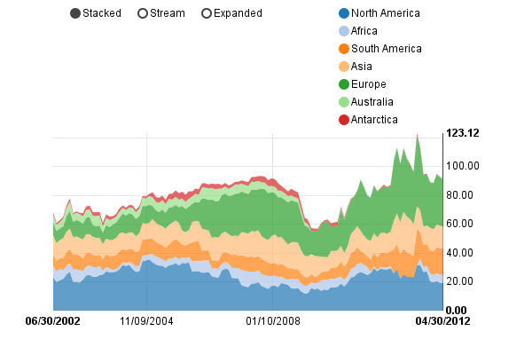

==================
Stacked Area Chart
==================

See the original `stacked area chart example`_.

.. _stacked area chart example: http://nvd3.org/examples/stackedArea.html

.. code-block:: python

   import nvd3

   chart = nvd3.StackedAreaChart()
   chart.margin({"right": 100})
   chart.x("function(d) { return d[0] }")  # We can modify the data
                                           # accessor functions...
   chart.y("function(d) { return d[1] }")  # ...in case your data is
                                           # formatted differently.
   chart.useInteractiveGuideline(True)  # Tooltips which show all data
                                        # points. Very nice!
   chart.rightAlignYAxis(True)  # Let's move the y-axis to the right side.
   chart.duration(500)
   chart.showControls(True)  # Allow user to choose 'Stacked', 'Stream',
                             # 'Expanded' mode.
   chart.stacked.clipEdge(True)
   # Format x-axis labels with custom function.
   chart.xaxis.tickFormat("""function(d) {
         return d3.time.format('%x')(new Date(d));
   }""")
   chart.yaxis.tickFormat("d3.format(',.2f')")

   # Data sample:
   # {
   #   "key" : "North America" , 
   #   "values" : [
   #     [ 1025409600000 , 23.041422681023],
   #     [ 1028088000000 , 19.854291255832],
   #     [ 1030766400000 , 21.02286281168], 
   #     [ 1033358400000 , 22.093608385173],
   #     [ 1036040400000 , 25.108079299458],
   #     [ 1038632400000 , 26.982389242348]
   #     ...
   url = "http://nvd3.org/examples/stackedAreaData.json"
   data_supplier = nvd3.JsonDataSupplier(url)
   nvd3.IPythonContainer(chart, data_supplier, width=600, height=400)

